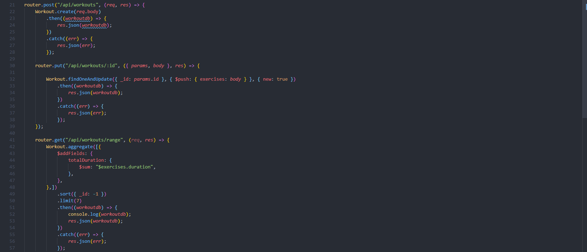
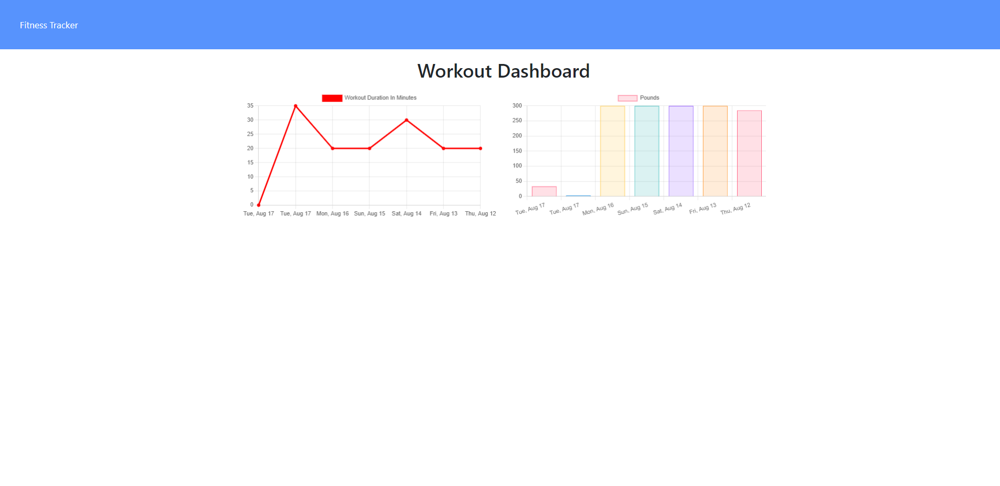

[](https://opensource.org/licenses/MIT)

# workout_tracker

A workout tracker where the user can track their workouts to help them with their fitness goals. It uses a MongoDB database with a Mongoose schema and handles routes with Express.

Deployment: https://andwilson-workout-tracker.herokuapp.com/?id=611d68544c6fbf1198509ef1

## Table of Contents

**[Objectives](#Objectives)**<br>
**[Media](#Media)**<br>
**[License](#License)**<br>

## Objectives

```
✔️  User can add exercises to the most recent workout plan.

✔️  User can add new exercises to a new workout plan.

✔️  User can view the combined weight of multiple exercises from the past seven workouts on the stats page.

✔️  User can view the total duration of each workout from the past seven workouts on the stats page.
```

## Media
This image shows the API routes being used.


This image shows the dashboard.


## License
The source code is licensed under MIT.
